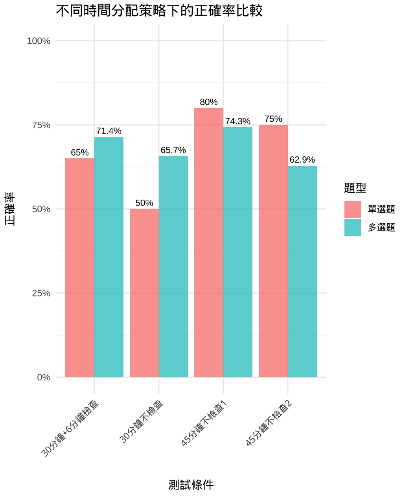

# 國文考試：從從容容游刃有餘

> 「寫完考卷，你應該馬上交卷，還是花時間檢查？」

國文算是我高中滿沒有自信的科目，而且訂正有時候也不知道核心的文本哪裡沒有理解清楚。考試的時候應該要「從從容容」好好做完一次考卷，還是應該要寫快，花點時間檢查？這一點也是我高中生妹妹的苦惱。所以我幫她設計一個小實驗，看看不同的測驗和檢查時間的搭配，到底會對國文考試的成績產生什麼影響。

這個實驗的目標很明確，我們想知道：
1.  **考試壓力**：正式考試的緊張感，真的會讓表現變差嗎？
2.  **檢查的價值**：「檢查時間」究竟是心理安慰，還是真的能搶救分數？

## 實驗設計

為了找出答案，妹妹進行了 4 次模擬考，每次的條件都有些不同：

| 測試情境 | 作答時間 | 檢查時間 | 備註 |
| :--- | :--- | :--- | :--- |
| **測試 1** | 45 分鐘 | 0 分鐘 | 模擬正式考試的緊張感 |
| **測試 2** | 30 分鐘 | 0 分鐘 | 壓力測試，時間極度壓縮 |
| **測試 3** | 30 分鐘 | 6 分鐘 | 驗證「檢查」的實際效果 |
| **測試 4** | 45 分鐘 | 0 分鐘 | 日常練習的基準線 |

每次的考卷結構都一樣，包含 **20 題單選** 和 **35 題多選**，盡量讓變因單純。

---

## 分析與發現：數據怎麼說？

在妹妹完成測試後，我把這些數據丟進 R 語言裡跑了一下，結果相當有趣。

### 📊 整體表現總覽

| 測試條件 | 單選題正確率 | 多選題正確率 | 總評 |
| :--- | :--- | :--- | :--- |
| 45分鐘（正式考試） | **80%** | **74.3%** | 🎯 **最佳表現**，壓力似乎是助力？ |
| 30分鐘不檢查 | 50% | 65.7% | 😅 **匆匆忙忙，連滾帶爬** |
| 30分鐘+6分鐘檢查 | 65% | 71.4% | 📈 **檢查有效**，分數顯著回升 |
| 45分鐘（練習） | 75% | 62.9% | 🤔 **狀態不穩**（可能專注力下降） |

### 🔍 關鍵發現

#### 1. 壓力是助力還是阻力？正式考試 vs. 練習

**結論：適度的壓力可能讓人更專注。**

我以為正式考試的緊張感會讓妹妹表現比較不好，但數據顯示恰恰相反。在同樣的 45 分鐘作答時間下，**正式考試情境的表現（單選 80%, 多選 74.3%）居然全面優於平常練習（單選 75%, 多選 62.9%）**。

這可能是因為在正式考試中，她的專注度和謹慎度都提到了最高，反而減少了粗心的錯誤。

#### 2. 「檢查」真的有用嗎？

**結論：單選題的檢查是有用的**

在同樣的 30 分鐘作答基礎上，多了 6 分鐘檢查，帶來了顯著的改善：
- **單選題**：正確率從 50% 大幅提升到 65% **（+15%）**。
- **多選題**：正確率也從 65.7% 提升到 71.4% **（+5.7%）**。

為什麼多選題改善比較少？其實是因為妹妹把檢查的 6 分鐘都拿去看那些不確定的單選題了。多選題因為選項複雜，檢查起來太花時間，投報率相對較低。

#### 3. 匆匆忙忙連滾帶爬：30分鐘 vs. 45分鐘

**結論：現在放棄比賽就結束了！**

從數據上看，30 分鐘的作答時間實在太倉促，單選題正確率直接掉到 50%，幾乎是猜題的水平。即使加上 6 分鐘檢查，也無法完全彌補一開始的倉促。這告訴我們，一個合理、充裕的作答時間是取得好成績的基礎。

### 📈 一點誠實的自白：關於統計可信度

老實說，這只是一個做了四次的小型實驗。在統計學上，我們沒有得到「顯著」的結論。不過作為一個探索性的個人研究，這些趨勢已經足夠提供一些參考。[^2]

---

## 實戰建議

綜合這次的實驗結果，以下總結了幾條實戰策略：

- **擁抱大考壓力**：別再自己嚇自己，正式考試時你可能會更強！
- **盡量保留檢查時間**：有檢查有保佑！（雖然可能把對的改錯，但可以錯的改對更多！）
- **時間規劃！**：寧可犧牲一點檢查時間，也要確保初次作答時有足夠的思考時間。如果 30 分鐘真的不夠，至少要留 35-40 分鐘。

## Appendix 1: 分析工具

這次的分析，我全程使用 **R 語言**進行，主要用了一些基本的統計方法和視覺化套件。統計分析利用：

- Fisher's Exact Test：因為樣本數小，不適合用 Chi-Squared Test。不過用 Fisher's Exact Test 得到的結果仍然不顯著，只能當作差異趨勢參考。

完整的分析腳本和數據都放在專案資料夾裡，有興趣的可以參考 `mandarin_exam_analysis_combined.R`。

---

## Appendix 2: 原始數據

### 寫 45 分鐘（不檢查）- 第一次

#### 單選

| Ground Truth | Count   |
|--------------|---------|
| True         | 13+3=16 |
| False        | 4+0=4   |
| **Total**    | 20      |

#### 多選

| Ground Truth / Prediction | True | False | **Total** |
|---------------------------|------|-------|-----------|
| True                      | 15   | 3     | 18        |
| False                     | 6    | 11    | 17        |
| **Total**                 | 21   | 14    | 35        |

### 寫 30 分鐘（不檢查）

#### 單選

| Ground Truth | Count  |
|--------------|--------|
| True         | 9+1=10 |
| False        | 8+2=10 |
| **Total**    | 20     |

#### 多選

| Ground Truth / Prediction | True | False | **Total** |
|---------------------------|------|-------|-----------|
| True                      | 13   | 5     | 18        |
| False                     | 7    | 10    | 17        |
| **Total**                 | 20   | 15    | 35        |

### 寫 30 分鐘 + 6 分鐘檢查

#### 單選

修改三題：兩題錯改對，一題沒有改對 → Improvement = +2

| Ground Truth | Count   |
|--------------|---------|
| True         | 10+3=13 |
| False        | 6+1=7   |
| **Total**    | 20      |

#### 多選

| Ground Truth / Prediction | True | False | **Total** |
|---------------------------|------|-------|-----------|
| True                      | 14   | 4     | 18        |
| False                     | 6    | 11    | 17        |
| **Total**                 | 20   | 15    | 35        |

### 寫 45 分鐘（不檢查）- 第二次

#### 單選

| Ground Truth | Count   |
|--------------|---------|
| True         | 11+4=15 |
| False        | 5+0=5   |
| **Total**    | 20      |

#### 多選

| Ground Truth / Prediction | True | False | **Total** |
|---------------------------|------|-------|-----------|
| True                      | 12   | 7     | 19        |
| False                     | 6    | 10    | 16        |
| **Total**                 | 18   | 17    | 35        |

> **關於多選題表格（Confusion Matrix）**
> 這個表格是一個「混淆矩陣」，用來呈現妹妹的答案（Prediction）與正確答案（Ground Truth）之間的關係。
>
> - **欄（Columns）**: `True` 表示妹妹**有選**該選項；`False` 表示**沒選**。
> - **列（Rows）**: `True` 表示該選項是**正確答案**；`False` 表示是**錯誤答案**。
> - **（True, True）**: 答對的選項 （選了，且該選）
> - **（False, True）**: 寫了但錯的選項 （選了，但不該選） （False Positive）
> - **（True, False）**: 對的沒答出來的選項 （沒選，但該選） （False Negative）
> - **（False, False）**: 錯的沒選

[^1]: 原始的多選題有 5 個選項，分開計算寫了但錯（FP: False Positive）和對的沒答出來（True Negative: TN）（eg. 正解是 ABD，如果作答 BCE，B、E 就是 FP，A、D 就是 TN）
[^2]: 統計上，這當然不構成顯著差異，但作為一個觀察趨勢的案例，已經非常有啟發性。
